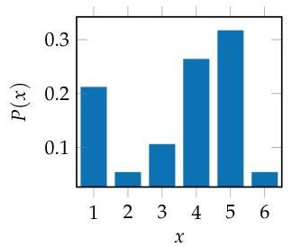
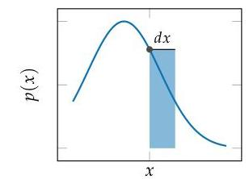
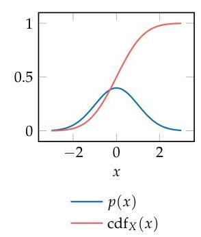
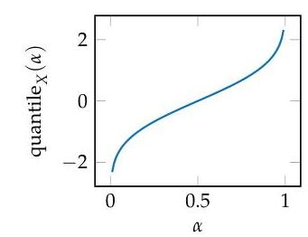
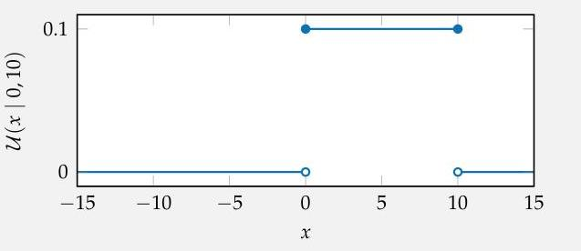

# dm_test

> This file was generated using Mistral OCR. Images are stored alongside this markdown file.

---

# dm_test

## Page 1

and transitivity assumptions lead to an ability to represent plausibility by a realvalued function $P$ that has the following two properties: ${ }^{3}$

$$
\begin{aligned}
& P(A)>P(B) \text { if and only if } A \succ B \\
& P(A)=P(B) \text { if and only if } A \sim B
\end{aligned}
$$

If we make a set of additional assumptions ${ }^{4}$ about the form of $P$, then we can show that $P$ must satisfy the basic axioms of probability (see appendix A.2). If we are certain of $A$, then $P(A)=1$. If we believe that $A$ is impossible, then $P(A)=0$. Uncertainty in the truth of $A$ is represented by values between the two extrema. Hence, probability masses must lie between 0 and 1 , with $0 \leq P(A) \leq 1$.

### 2.2 Probability Distributions

A probability distribution assigns probabilities to different outcomes. ${ }^{5}$ There are different ways to represent probability distributions depending on whether they involve discrete or continuous outcomes.

### 2.2.1 Discrete Probability Distributions

A discrete probability distribution is a distribution over a discrete set of values. We can represent such a distribution as a probability mass function, which assigns a probability to every possible assignment of its input variable to a value. For example, suppose that we have a variable $X$ that can take on one of $n$ values: $1, \ldots, n$, or, using colon notation, $1: n .{ }^{6} \mathrm{~A}$ distribution associated with $X$ specifies the $n$ probabilities of the various assignments of values to that variable, in particular $P(X=1), \ldots, P(X=n)$. Figure 2.1 shows an example of a discrete distribution.

There are constraints on the probability masses associated with discrete distributions. The masses must sum to 1 :

$$
\sum_{i=1}^{n} P(X=i)=1
$$

and $0 \leq P(X=i) \leq 1$ for all $i$.
For notational convenience, we will use lowercase letters and superscripts as shorthand when discussing the assignment of values to variables. For example, $P\left(x^{3}\right)$ is shorthand for $P(X=3)$. If $X$ is a binary variable, it can take on the value of true or false. ${ }^{7}$ We will use 0 to represent false and 1 to represent true. For example, we use $P\left(x^{0}\right)$ to represent the probability that $X$ is false.
${ }^{3}$ See discussion in E.T. Jaynes, Probability Theory. The Logic of Science. Cambridge University Press, 2003.
${ }^{4}$ The axiomatization of subjective probability is given by P. C. Fishburn, "The Axioms of Subjective Probability," Statistical Science, vol. 1, no. 3, pp. 335-345, 1986. A more recent axiomatization is contained in M.J. Dupré and F. J. Tipler, "New Axioms for Rigorous Bayesian Probability," Bayesian Analysis, vol. 4, no. 3, pp. 599-606, 2009.
${ }^{5}$ For an introduction to probability theory, see D. P. Bertsekas and J. N. Tutsiklis, Introduction to Probability. Athena Scientific, 2002.

Figure 2.1. A probability mass function for a distribution over $1: 6$.
${ }^{6}$ We will often use this colon notation for compactness. Other texts sometimes use the notation $[1 \ldots n]$ for integer intervals from 1 to $n$. We will also use this colon notation to index into vectors and matrices. For example $x_{1: n}$ represents $x_{1}, \ldots, x_{n}$. The colon notation is sometimes used in programming languages, such as Julia and MATLAB.
${ }^{7}$ Julia, like many other programming languages, similarly treats Boolean values as 0 and 1 in numerical operations.
(c) 2022 Massachusetts Institute of Technology, shared under a Creative Commons CC-BY-NC-ND license.
2024-02-06 20:54:49-08:00, comments to bugs@algorithmsbook.com

---

## Page 2

The parameters of a distribution govern the probabilities associated with different assignments. For example, if we use $X$ to represent the outcome of a roll of a six-sided die, then we would have $P\left(x^{1}\right)=\theta_{1}, \ldots, P\left(x^{6}\right)=\theta_{6}$, with $\theta_{1.6}$ being the six parameters of the distribution. However, we need only five independent parameters to uniquely specify the distribution over the outcomes of the roll because we know that the distribution must sum to 1.

### 2.2.2 Continuous Probability Distributions

A continuous probability distribution is a distribution over a continuous set of values. Representing a distribution over a continuous variable is a little less straightforward than for a discrete variable. For instance, in many continuous distributions, the probability that a variable takes on a particular value is infinitesimally small. One way to represent a continuous probability distribution is to use a probability density function (see figure 2.2), represented with lowercase letters. If $p(x)$ is a probability density function over $X$, then $p(x) d x$ is the probability that $X$ falls within the interval $(x, x+d x)$ as $d x \rightarrow 0$. Similar to how the probability masses associated with a discrete distribution must sum to 1 , a probability density function $p(x)$ must integrate to 1 :

$$
\int_{-\infty}^{\infty} p(x) \mathrm{d} x=1
$$

Another way to represent a continuous distribution is with a cumulative distribution function (see figure 2.3), which specifies the probability mass associated with values below some threshold. If we have a cumulative distribution function $P$ associated with variable $X$, then $P(x)$ represents the probability mass associated with $X$ taking on a value less than or equal to $x$. A cumulative distribution function can be defined in terms of a probability density function $p$ as follows:

$$
\operatorname{cdf}_{X}(x)=P(X \leq x)=\int_{-\infty}^{x} p\left(x^{\prime}\right) \mathrm{d} x^{\prime}
$$

Related to the cumulative distribution function is the quantile function, also called the inverse cumulative distribution function (see figure 2.4). The value of quantile ${ }_{X}(\alpha)$ is the value $x$ such that $P(X \leq x)=\alpha$. In other words, the quantile function returns the minimum value of $x$ whose cumulative distribution value is greater than or equal to $\alpha$. Of course, we have $0 \leq \alpha \leq 1$.

There are many different parameterized families of distributions. We outline several in appendix B. A simple distribution family is the uniform distribution

Figure 2.2. Probability density functions are used to represent continuous probability distributions. If $p(x)$ is a probability density, then $p(x) d x$ indicated by the area of the blue rectangle is the probability that a sample from the random variable falls within the interval $(x, x+d x)$ as $d x \rightarrow 0$.

Figure 2.3. The probability density function and cumulative distribution function for a standard Gaussian distribution.

Figure 2.4. The quantile function for a standard Gaussian distribution.

---

## Page 3

$\mathcal{U}(a, b)$, which assigns probability density uniformly between $a$ and $b$, and zero elsewhere. Hence, the probability density function is $p(x)=1 /(b-a)$ for $x$ in the interval $[a, b]$. We can use $\mathcal{U}(x \mid a, b)$ to represent the density at $x .{ }^{6}$ The support of a distribution is the set of values that are assigned nonzero density. In the case of $\mathcal{U}(a, b)$, the support is the interval $[a, b]$. See example 2.1.

The uniform distribution $\mathcal{U}(0,10)$ assigns equal probability to all values in the range $[0,10]$ with a probability density function:

$$
\mathcal{U}(x \mid 0,10)= \begin{cases}1 / 10 & \text { if } 0 \leq x \leq 10 \\ 0 & \text { otherwise }\end{cases}
$$

The probability that a random sample from this distribution is equal to the constant $\pi$ is essentially zero. However, we can define nonzero probabilities for samples being within some interval, such as $[3,5]$. For example, the probability that a sample lies between 3 and 5 given the distribution plotted here is:

$$
\int_{3}^{5} \mathcal{U}(x \mid 0,10) \mathrm{d} x=\frac{5-3}{10}=\frac{1}{5}
$$

The support of this distribution is the interval $[0,10]$.

Another common distribution for continuous variables is the Gaussian distribution (also called the normal distribution). The Gaussian distribution is parameterized by a mean $\mu$ and variance $\sigma^{2}$ :

$$
p(x)=\mathcal{N}\left(x \mid \mu, \sigma^{2}\right)
$$

Here, $\sigma$ is the standard deviation, which is the square root of the variance. The variance is also commonly denoted by $v$. We use $\mathcal{N}\left(\mu, \sigma^{2}\right)$ to represent a Gaus-

[^0]
[^0]:    ${ }^{6}$ Some texts use a semicolon to separate the parameters of the distribution. For example, one can also write $\mathcal{U}(x ; a, b)$.

    Example 2.1. An example of a uniform distribution with a lower bound of 0 and an upper bound of 10 .